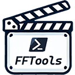

# Dmi3.PowerShell.PowerTools

[](https://www.powershellgallery.com/packages/Dmi3.PowerShell.FFTools)
[](https://www.powershellgallery.com/packages/Dmi3.PowerShell.FFTools)
[](https://github.com/drandarov-io/Dmi3.PowerShell.FFTools/blob/master/LICENSE)



This module provides a set of concise and straight-forward commands building on top of ffmpeg to work with multimedia files.

## My other PowerShell modules
- [Dmi3.PowerShell.PowerTools](https://github.com/drandarov-io/Dmi3.PowerShell.PowerTools)
  - TODO: Image
- WIP: ~~[Dmi3.PowerShell.PowerFetch](https://github.com/drandarov-io/Dmi3.PowerShell.PowerFetch)~~
  - TODO: Image

## Installation

```powershell
    Install-PSResource Dmi3.PowerShell.FFTools
```

## TODOs
- [ ] Return proper PowerShell objects
- [ ] Fix CompatiblePSEditions in manifest
- [ ] Create proper icon
- [ ] Add images to the command (with carbon?)
- [ ] Add tests

## Documentation

### Examples
```powershell

```

### General parameters

### Commands

### `subsync`
```powershell

```

### `extract`
```powershell

```

### `copytranscode`
```powershell

```

### `countstreams`
```powershell

```

### `codecs`
```powershell

```

### `audiomap`
```powershell

```

### `map`
```powershell

```

### `merge`
```powershell

```

## Publishing

```powershell
Publish-PSResource .\Dmi3.PowerShell.FFTools\ -ApiKey (Get-Secret pwgallery_key -AsPlainText)
```